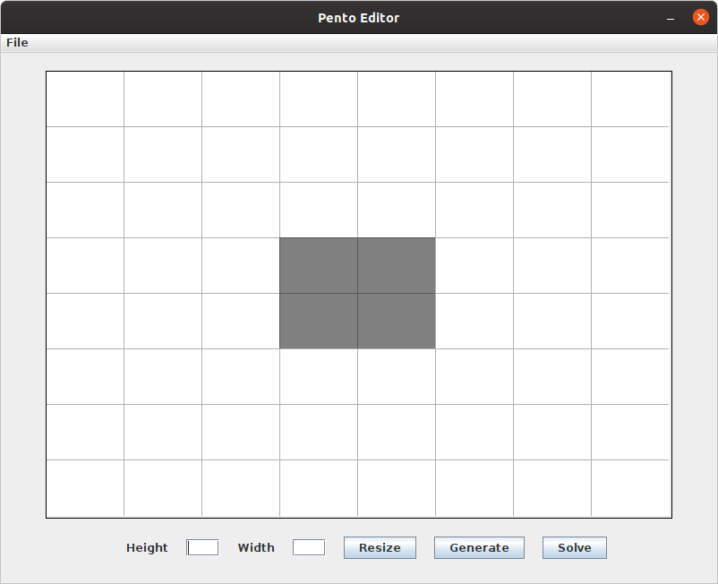
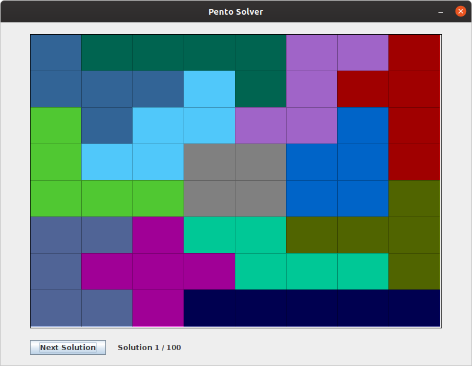

# pentosolver

This is a graphical program to find solutions to [pentomino](https://en.wikipedia.org/wiki/Pentomino) puzzles.

## Instructions

Run the jar file in the `target/` directory by double clicking or running

    java -jar pentosolver-1.0-SNAPSHOT-jar-with-dependencies.jar

This will open an editor window. You can edit the board by clicking on the blocks to make them empty or solid.

You can resize the board by typing a width and height and then pressing the **resize** button. You can then press the **generate** button to randomly generate blocks in the current board. Finally you can solve the board by pressing the **solve** button.

### File Operations

The menu contains buttons to export the current board or load a board from a file. To export the current board press **export** and choose a destination file. To load a board from file press **open** and select the file to open. The file must only contain ASCII text where each line is a row in the board, with a space for an empty block and an asterisk for a solid block.

### Solutions

The solutions window shows a solution to the board from the editor if there are any. The program will generate up to 100 solutions to the board although there may be more. You can browse through the solutions by pressing the **next solution** button.

## Development

This project uses Maven for build management. A jar file can be compiled and packaged with the following command.

    mvn assembly:assembly

